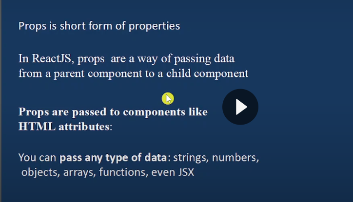

what is a ract ? 

react js compoment based javascript librray  used to build dynamic user interface 
অথাত react দিয়ে আমরা cliend compoment and fond end devlopemnt করতে পারি 

it simplifies the creation of single page (SPAs) with fonece perfomece and maintainbility 

react js single page base

================================ react history ======================= 

রিঅ্যাক্ট তৈরি করেন জর্ডান ওয়াক যিনি মেটা তৎকালীন ফেসবুক-এর একজন সফটওয়্যার ইঞ্জিনিয়ার ছিলেন এবং ২০১১ সালে "FaxJS" নামে এর প্রথম প্রোটোটাইপটি তৈরি করেন

এক দশকেরও বেশি সময় ধরে, মেটা এই প্রযুক্তির উপর কঠোর নিয়ন্ত্রণ বজায় রেখেছিল। ২০২৬ সালের ফেব্রুয়ারিতে একটি বড় ঐতিহাসিক পরিবর্তনের মাধ্যমে, প্রকল্পটি আনুষ্ঠানিকভাবে রিয়্যাক্ট ফাউন্ডেশন-এরঅধীনে স্থানান্তরিত হয়, যা লিনাক্স ফাউন্ডেশন-এর ছত্রছায়ায় পরিচালিত একটি নবগঠিত সংস্থা । এই পদক্ষেপটি রিয়্যাক্ট-এর ভবিষ্যৎ ব্যবস্থাপনা এবং মেধাস্বত্ব অধিকারকে একটি একক কর্পোরেশন থেকে একটি কমিউনিটি-চালিত, উন্মুক্ত শিল্প মানে রূপান্তরিত করে।

>It is developed and by Facebook & now maintained by community developer.

> Uses a virtual DOM for faster updates.

> Supports a declarative approach to designing UI components.

> Ensures better application control with one-way data binding.
==================== what is a react compoment ===================================================
রিঅ্যাক্ট কম্পোনেন্টস (React Components) হলো রিঅ্যাক্ট অ্যাপ্লিকেশনের মূল ভিত্তি। এগুলো হলো ছোট, স্বাধীন এবং পুনর্ব্যবহারযোগ্য (reusable) কোডের টুকরো, যা জাভাস্ক্রিপ্ট ফাংশন বা ক্লাসের মতো কাজ করে এবং ওয়েবসাইটের ইউজার ইন্টারফেস (UI) বা HTML রিটার্ন করে। পুরো ওয়েবসাইটকে ছোট ছোট ভাগে ভাগ করে কাজ করতে এগুলো সাহায্য করে।

>components are the building blocks of a React application
> A component is essentially a reusable, self-contained piece of UI.
>React allows you to break down a complex UI into smaller, manageable pieces
> React offers two main types of components: functional components and class components.

========================= react set up process with vite  ======================================

what is a vite: vite হল একটা modern fondend build tool যা দিয়ে আমরা react create run করতে পারি এবং express js vinila java script o run create korte pari 

vite crate আমদের commend holio :  npm create vite@latest 

teeminal  ba cmd te jodi amra ai commend ta dei তাহলে 
১ম  এ আমদের project name দিতে বলবে তারপর 
২য় fremwork select then কি দিয়ে পারবা js and 
৩য় vile js ta select kore nibo next 
৪র্থ cd diye project name dibo oi file a cole jabo
project run করা বা ইনফো রাখের জন আমরা 
৫ম npm install kore nibo  node module file asbe and jason.lock o asbe 

======================= whay use vite create with react =====================================

কয়েক সেকেন্ডে React project তৈরি হয়ে যায়। 
Development server খুব দ্রুত চালু হয়। 
বড় project হলেও start হতে বেশি সময় লাগে না।
Code save করলেই browser-এ সাথে সাথে update দেখা যায়। fast hot reload হয় 
পুরো app rebuild করতে হয় না।
Website faster load করে।

=============== project run ===================

react project ২ ভাবে run করা যায় 

১. npm run dev 
2. npx vite 
এই ২ টা commaend চালিলে সেম একই ভাবে porject ta run হবে 

আমরা যদি এই গুলা না দিয়ে নিজের মত করে সেট করতে চাই থাহলে তাও করতে পারব 
package.json ফিলে গিয়ে dev নামে যেই টা আছে ওইটা change kore new name দিব যেইটা আমরা দিয়ে porject run korte chai 

=================== run build =================================

react a buil ki kore 

ব JavaScript file optimize হয় file ছোট করে অপ্রয়োজনীয় code remove হয়। 
css minify হয় ফাকা অ্যান্ড কমেন্ট ডিলিট করে দেয়  
Multiple file bundle হয়  জাতে Browser দ্রুত load করতে পারে।
Performance বাড়ে ওয়েব সাইট তারাতারি open হয় 
dist ফোল্ডার তৈরি হয় 
 dist folder-এ তোমার React/Vite project-এর final production files থাকে, যেগুলো browser সরাসরি ব্যবহার করতে পারে।
 
 আমরা যদি শুধু এই ফিলে রান করতে পারি 

এবং আমরা npx vite build দিয়ে চানং ফিলে তৈরি করতে পারি 

